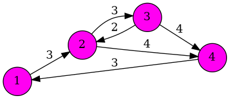

 # 📋Laboratorio 6
 ## ⚙️Algoritomo de Dijkstra
 ### 📘Descipcion:

Con el algoritmo de Dijkstra se puede encontrar la ruta o el camino con menor costo entre los nodos de un ***grafo dirigido*** desde el nodo de origen a los otros nodos del grafo
 En este codigo se busca ***optimizar*** el recorrido de un grafo usando la logica del Algoritmo de Dijkstra

---

## 📁Arquitectura del laboratorio 6

 ```plaintext
FINAL
|
├──Parra_Agustin_Lab6_ejercicio1.cpp #Programa principal
├──grafo.png #Imagen que describe el programa generada por el archivo DOT
├──grafo.dot #Formato que usa Graphviz para describir cómo dibujar un grafo
├──ejercicio1 #ejecutable del programa
├──Readme.md #Descripcion del funcionamiento del programa
```

---

## 📘Funciones usadas


+ ***Inicializar_Matriz:*** Permite crear la matriz inicial
+ ***imprimir_Matriz:*** Muestra una salida de la matriz inicializada
+ ***nodo_Minimo:*** Busca el nodo con el menor costo
+ ***generarArchivoGraphviz:*** Exporta la imagen del grafo
+ ***Dijkstra:*** Busca el camino mas corto segun el Algortimo de Dijkstra
+ ***main:*** Crea la matriz (mxn), imprime el camino mas corto y libera memoria para los punteros

---

## ✒️Compilacion

Para compilar el programa se debe colocar:
+ ./***nombre_del_ejecutable*** + ***filas y columnas de la matriz en general***

### referencia:
 ```bash
 ./ejercicio1 4
 ```
---

### ✅RESULTADOS

---

## 🌳Imagen generada 



#### 📘Descripcion:

Se creo un grafo de 4 nodos, matriz inicializada 4x4 en este caso el nodo origen es 1, la matriz inicial seria:

---
```bash
1 3 - - 
- 1 3 4 
- 2 1 4 
3 - - 1 
```
---
con  ( - ) representando infinitos, el recorrido final utilizando la logica del algoritmo seria:

---
```bash
NODO 1 costo: 0
NODO 2 costo: 3
NODO 3 costo: 6
NODO 4 costo: 7
```
---

### 🧩Diagrama de Flujo del grafo

```mermaid
digraph G {
rankdir=LR;
node [shape=circle style=filled fillcolor="#ff00f2ff"];
1 -> 2 [label="3"];
2 -> 3 [label="3"];
2 -> 4 [label="4"];
3 -> 2 [label="2"];
3 -> 4 [label="4"];
4 -> 1 [label="3"];
}
```
#### Descipcion del flujo:

|Origen| Destino| Costo|
|------|--------|------|
|  1   |    2   |   3  |
|  2   |    3   |   3  |
|  2   |    4   |   4  |
|  3   |    2   |   2  | 
|  3   |    4   |   4  |
|  4   |    1   |   3  |

---
## Referencias

+ dijkstra.c 
+ ejemplo_matriz.cpp
+ [Algoritmo de Dijkstra en C/C++](https://favtutor-com.translate.goog/blogs/dijkstras-algorithm-cpp?_x_tr_sl=en&_x_tr_tl=es&_x_tr_hl=es&_x_tr_pto=tc)
+ [Runestone_Academy](https://runestone.academy/ns/books/published/cppds/Graphs/DijkstrasAlgorithm.html?utm_source=chatgpt.com) 
---

## 🧑🏻‍🎓Alumno

+ Agustin Parra
+ ***Fecha:*** 02/noviembre/2025
+ ***Asignatura*:** Algoritmo y Estructura de Datos
+ ***Carrera:*** Ingenieria Civil en Bioinformatica
+ **Universidad de Talca**
---


 