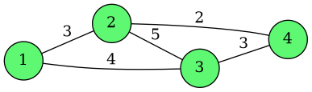
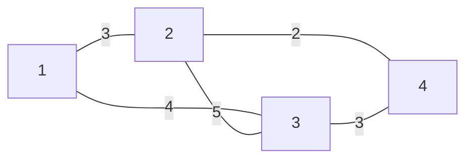

# 📋 Laboratorio 7
## 🛤️ Algoritmo de PRIM

#### 📘 Descripcion: 

El Algoritmo de PRIM trata de buscar el ***arbol de expansion minima (MST)*** en un grafo ***ponderado no Dirigido***

El proposito de este codigo es a partir de una matriz inicial encontrar las rutas con menores costos del grafo final

---

### 📁 Arquitectura del laboratorio 7

```plaintext

FINAL
|
├──Parra_Agustin_Lab7_ejercicio1.cpp #Codigo principal
├──grafo.dot #Formato que usa Graphviz para describir cómo dibujar un grafo
├──grafo.png #Imagen representativa del grafo final
├──ejercicio1 #Ejecutable del codigo
```
---
### 🫀 Funciones usadas

+ ***imprimir_Matriz:*** Visualiza por terminal la matriz inicializada
+ ***camino_Minimo:*** Busca el camino con menor costo del grafo no dirigido
+ ***generarArchivoGraphviz:*** Exporta la imagen del grafo no dirigido con sus respectivos costos
+ ***Prim:*** Busca el *MST* con la logica del Algoritmo de Prim
+ ***main:*** Crea la matriz (mxn), imprime el MST y libera memoria para los punteros
---

### ✍🏻 Compilacion


Como utilizamos *argc* y *argv* para crear la matriz se debe compilar con el ***nombre del ejecutable + las dimensiones de la matriz*** 

#### *Referencia:*

```bash
./lab7 4
```
---

## ✅Resultados esperados

### 🌳 Imagen generada



#### 📘 *Descripcion:*

Se creo un grafo de 4 nodos, matriz inicializada 4x4 en este caso el nodo origen es 1, la matriz inicial seria:

---
``` bash
MATRIZ INICIALIZADA
1 3 4 - 
- 1 5 2 
- - 1 3 
2 - 1 1 
```
---

con  ( - ) representando infinitos, el recorrido final utilizando la logica del algoritmo seria:

``` bash
Nodos del grafo de costo minimo: 
Nodo 1 - Nodo 2 Costo: 3
Nodo 4 - Nodo 3 Costo: 1
Nodo 2 - Nodo 4 Costo: 2
```
---


### 🔎 Diagrama de flujo del grafo


---

#### 📘 *Descripcion del flujo:*

|Origen |Destino |Costo|
|-------|--------|-----|
|   1   |   2    |   3 |
|   1   |   3    |   4 |
|   2   |   3    |   5 |
|   2   |   4    |   2 |
|   3   |   4    |   3 |

---

###  📚 Referencias

+ ejemplo_matriz.cpp
+ Parra_Agustin_Lab6_ejercicio1.cpp
+ [Algoritmo_de_PRIM](https://www-freecodecamp-org.translate.goog/news/prims-algorithm-explained-with-pseudocode/?_x_tr_sl=en&_x_tr_tl=es&_x_tr_hl=es&_x_tr_pto=tc#heading-what-is-prims-algorithm)

---

## 🧑🏻‍🎓Alumno

+ Agustin Parra
+ ***Fecha:*** 02/noviembre/2025
+ ***Asignatura*:** Algoritmo y Estructura de Datos
+ ***Carrera:*** Ingenieria Civil en Bioinformatica
+ **Universidad de Talca**
---


