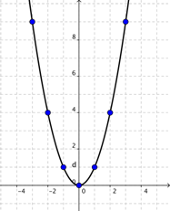
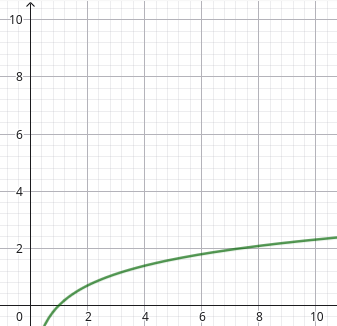

# 📋 Laboratorio 8
## Metodos de Ordenamientos

#### 📘 Descripcion:

Un metodo de ordenacion sirve para ***organizar*** un conjunto de datos siguiendo criterios especificos.

En este laboratorio se trabajara sobre los metodos **Bubblesort**, **Insercion**, **Seleccion**, **Shellsort** y **Quicksort**.

---

### 📁 Arquitectura del laboratorio 8

```plaintext
FINAL
|
├──Parra_Agustin_Lab8.cpp #Codigo principal
├──lab8 #Ejecutable del codigo
├──Readme.md #Explicacion del codigo
```
---

### 🫀 Funciones Usadas

| ***copyArreglo*** |
|-------------------|
| Copia los valores de un arreglo a otro. Antes de aplicar cada método de ordenación, debo volver a tener el mismo arreglo desordenado inicial |

---

| ***mostrarArreglo*** |
|----------------------|
| Muestra el arreglo en el terminal |

---

| ***bubbleSort*** |
|------------------|
| Compara preguntadose: ***¿mi dato actual es mayor que el siguiente?*** |

---

| ***Insercion*** |
|------------------|
|Compara preguntadose: ***¿El dato que tengo a la izquierda es mayor que mi dato actual?***, Si es mayor, lo mueve una posición a la derecha hasta encontrar el lugar correcto |

---

| ***Seleccion*** |
|-----------------|
| Ordena tomando los elementos y colocandolo en su posicion normal |

---

| ***shellSort*** |
|-----------------|
| Calcula la mitad de los datos (i = N/2) y los compara la distancia entre cada dato segun i que es la respuesta de la operacion anterior y asi ciclicamente |

| ***Reduce*** |
|--------------|
| Divide en dos el arreglo segun un pivote, dejando los menores a un lado y al otro los mayores |

---

| ***quickSort*** |
|-----------------|
| Mientras haya segmentos en las pilas, extrae un rango del arreglo y llama a Reduce para dividirlo alrededor del pivote. Reduce devuelve la posición final del pivote, y los subsegmentos izquierdo y derecho resultantes se vuelven a guardar en las pilas para seguir ordenándolos |

---

### ✍🏻 Compilacion

Como en el código se utilizaron **argc** y **argv**, para compilar y ejecutar el programa se debe escribir:
el ***nombre del ejecutable + el número de datos + “s” (sí) o “n” (no)*** dependiendo de si se desea mostrar los datos utilizados.

#### *Referencia*

```bash
./lab8 10000 n
```
---

## ✅ Resultados esperados

Como la curva de los metodos de ordenamientos cuadraticos en el grafico crece sin control se espera que para **datos de gran tamaño** estos metodos como ***Bubblesort***, ***Inserccion*** y ***Seleccion*** sean **poco eficiente** pero con **datos pequeños** sean mas eficientes que los metodos logaritmicos.

#### 📈 *Imagen de Referecia* 



Y como la curva de los metodos de ordenamiento logaritmicos; ***Shellsort*** y ***Quicksort***  crece hasta estabilizarse en algun momento, con **datos de un tamaño reducido** esta es **poco eficiente** en viceversa con **datos de gran tamaño** esta sea **muy eficiente**

#### 📉 *Imagen de Referencia*



#### 📤 *Salida de texto final*

***Con 10.000 datos***

```bash
Metodo      | Tiempo
-----------------------------------------
Burbuja | 211 milisegundos
Insercion | 70 milisegundos
Seleccion | 136 milisegundos
Shellsort | 5 milisegundos
Quicksort | 1 milisegundos
```
***Metodo mas eficiente***:  Quicksort

---

## 📚 Referencia

+ Tema_7-Busq_Interna-Cuadraticos-1.pdf
+ Tema_8-Busq_Interna-Logaritmicos.pdf

## 🧑🏻‍🎓Alumno

+ Agustin Parra
+ ***Fecha:*** 15/noviembre/2025
+ ***Asignatura*:** Algoritmo y Estructura de Datos
+ ***Carrera:*** Ingenieria Civil en Bioinformatica
+ **Universidad de Talca**
---


 


