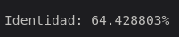
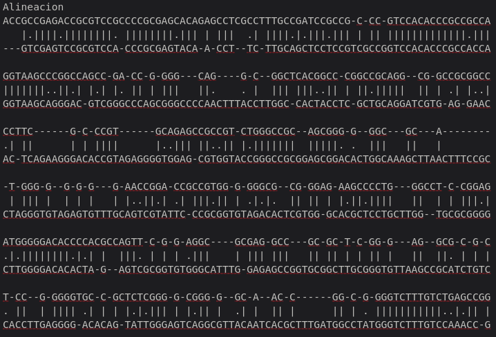

# 🧑‍🏫 Proyecto
# 🧬 Algortimo Needleman-Wunsch
### 📋 Descripcion

---

El algoritmo de Needleman-Wunsch es un
algoritmo para comparar secuencias de
ADN, ARN o proteinas ocupada
especialmente en la Bioinformatica, se puede deglosar en 3 etapas: 

+ ***Inicializacion***
+ ***Llenado de la matriz***
+ ***Backtracking*** 

### 🗂️ Arquitectura del Proyecto

```plaintext

Proyecto
│
├── proyecto.cpp #programa final del Algoritmo de Needleman-Wunsch
├── Alineamiento_Final.txt #resultados finales del alineamiento
├── gene_ACTB_sapiens.fna #secuencia de Beta Actina del Homo-Sapiens para el alineamiento
├──  gene_ACTB_rattus.fna #secuencia de Beta Actina de rata para el alineamiento
├── alineamiento.dot #archivo para generar el png
├── alineamiento.png #png final del alineamieto
├── proyecto # ejecutable del programa
```

---

### 🫀 Funciones Importantes

+ ***indicaBase***: Convierte las bases (A,C,G,T) en un índice para poder acceder a la matriz U 


+ ***leerSecuencia***: Lee los archivos FASTA ignorando la cabecera '>'


+ ***leematrizU***: Lee desde un archivo de texto la matriz de sustitución U (scores de match/mismatch entre A, C, G y T) y la guarda en la matriz global MatrizU[4][4].


+ ***inicializarMatriz***: Rellena la matriz con valores acumulativos de V y se fijan punteros y direcciones en cada celda


+ ***llenarMatriz***: Llena la matriz dinámica de Needleman–Wunsch (M) calculando el mejor score para cada celda y guardando desde dónde viene (diagonal, arriba o izquierda).


+ ***Reconstruccion***: Hace el BACKTRACKING empezando desde la esquina inferior derecha, siguiendo las direcciones gurdadas y calcula el porcentaje de identidad


+ ***generarGraphviz***: Crea un archivo .dot para visualizar gráficamente el alineamiento usando Graphviz y luego generar un PNG.
---

### 📤 Compilacion

Para la compilacion del programa se necesitan 9 datos:
+ ***./ejecutable*** = nombre del ejecutable
+ ***-C1 secuencia1*** = primer archivo de la secuencia para alinear
+ ***-C2 secuencia2*** = segundo archivo de la secuencia del alineamiento
+ ***-U funcionU.txt*** = matriz de sustitucion del algoritmo
+ ***-V -2*** = valor de penalizacion de la apertura de gaps

#### Representacion:

```bash
 ./proyecto2 -C1 gene_ACTB_sapiens.fna -C2 gene_ACTB_rattus.fna -U funcionU.txt -V -2
```
---

## ✅ Resultados Esperados

El alineamiento de las dos secuencias genera un archivo .**txt** en el que se presentan los resultados finales del alineamiento, junto con el valor de identidad entre ambas secuencias. Dado que las secuencias corresponden a genes ortólogos, se esperaba obtener un valor de identidad medianamente alto. El valor obtenido fue de aproximadamente **64%**, lo que permite concluir que los genes pertenecen a la misma familia proteica, aunque corresponden a especies diferentes.

#### Imagenes de Referencia




### 🔍 Observaciones

+ En el programa es posible colocar valor de penalizacion positivos creando un resultado favorable a la apertura de gaps puesto que no existe una "penalizacion" por la abertura si no un "beneficio"
+ Por comodidad los reultados no se muestran en la terminal si no se exportan a un txt para que no exista una "contaminacion visual" en la terminal
---

### 👨🏻‍🎓 Alumno
+ Agustin Parra
+ Fecha: 12/diciembre/2025
+ Asignatura: Algoritmo y Estructura de Datos
+ Carrera: Ingenieria Civil en Bioinformatica
+ Uiversidad de Talca


---


