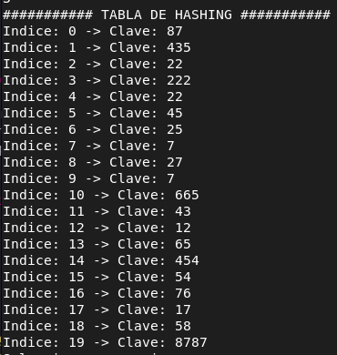

# 📋 LABORATORIO 9

## 🔎 Metodos de Busqueda - Tablas HASH

#### 📘 DESCRIPCION

Una función ***HASH*** sirve para convertir una clave (como un nombre, código o ID) en un índice dentro de un arreglo. Las tablas hash utilizan esta conversión para guardar y buscar datos de forma muy rápida, reduciendo significativamente el tiempo de búsqueda.

Este laboratorio implementa las pruebas, busquedas vistas en clases ademas de arreglas las colisones de datos

---

### 📁 Arquitectura del Laboratorio 9

```plaintext
FINAL
|
├── Parra_Agustin_Lab9.cpp #Codigo principal
├── lab9 #Ejecutable del codigo principal
├── Readme.md #Explicacion del codigo
```
---

### 🫀 Funciones Importantes

| (1) inicializarTabla |
|----------------------|
| Inicializa la tabla hash con valores nulos |

| (2) inicializarLista |
|----------------------|
| Inicializa la tabla hash para el encadenamiento dejando los nodos apuntado a nulo |


| (3) hashing1 |
|--------------|
| Ocupa la funcion hash del *modulo* (***k % maximo***) |


| (4) hashing2 |
|--------------|
| Utiliza una funcion hash del *plegamiento* (***suma de los bloques del numero % maximo*** ) |


| (5) pruebaLineal |
|------------------|
| Resuleve las colisines con el metodo de ***Prueba Lineal*** |


| (6) pruebaCuadratica |
|----------------------|
| Resuelve la colisiones con el metodo de ***Prueba Cuadratica*** |


| (7) pruebadobleInserccion |
|---------------------------|
| Resuelve las colisiones con el metodo de ***Prueba de doble inserccion*** |

| (8) pruebaEncadenamiento |
|--------------------------|
| Resuelve las colisiones con el metodo de ***Encadenamiento*** con una lista enlazada|

| (9) busquedaLineal |
|--------------------|
| Busca el dato correspondiente con el metodo correspondiente (***Lineal***) |


| (10) busquedaCuadratica |
|-------------------------|
| Busca el dato correspondiente con el metodo correspondiente (***Cuadratica***) |


| (11) busquedaDobleInserccion |
|------------------------------|
| Busca el dato correspondiente con el metodo correspondiente (***Doble inserccion***) |


| (12) busquedaEncadenamiento |
|-----------------------------|
Busca el dato correspondiente con el metodo correspondiente (***Encadenamiento***) con una lista enlazada |

---

### ✍🏻 Compilacion

Como en el código se utilizaron **argc** y **argv**, para compilar y ejecutar el programa se debe escribir:
el ***nombre del ejecutable + argumento L, C, D o E*** 
+ **L** = Prueba Lineal
+ **C** = Prueba Cuadratica
+ **D** = Prueba de doble Hash
+ **E** = Encadenamiento

#### Referencia

```bash
./lab9 [L|C|D|E]
```
---

## ✅ Resultados esperados

Como resultado, el programa funcionó de manera correcta, y mediante la función mostrar se pudo visualizar claramente el mecanismo utilizado por cada solución para manejar las colisiones.

#### Imagen de referencia



En este caso podemos obeservar que al hacer el modulo de 45 y 25 los cuales son 5 entoces se le asigno la posicion 5 al 45 y al 25 la 6 una adelantes de este por el orden de llegada de los datos

---

#### 👀 Observaciones

+ Para resolver el código me guié por la implementación del pseudocódigo visto en clases. Sin embargo, al programarlo me aparecieron varios errores, por lo que supuse que el pseudocódigo podía contener algún detalle incorrecto o tal vez pase por alto un error mio.

----

## 🧑🏻‍🎓Alumno

+ Agustin Parra
+ ***Fecha:*** 15/noviembre/2025
+ ***Asignatura*:** Algoritmo y Estructura de Datos
+ ***Carrera:*** Ingenieria Civil en Bioinformatica
+ **Universidad de Talca**
---
